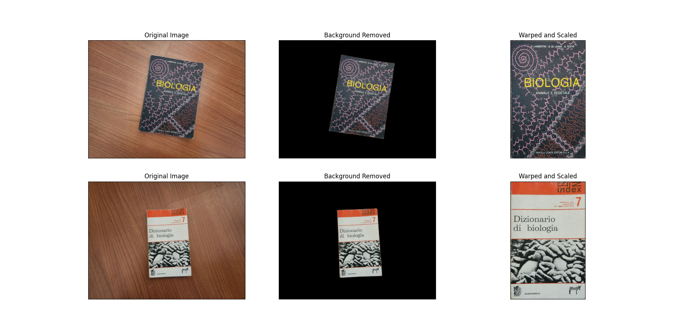
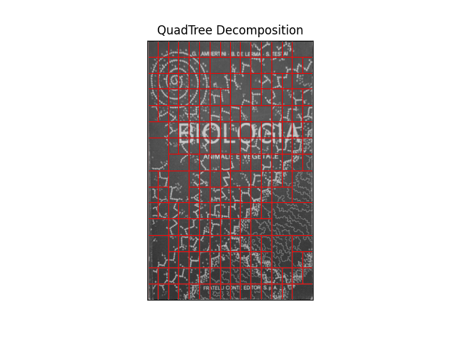
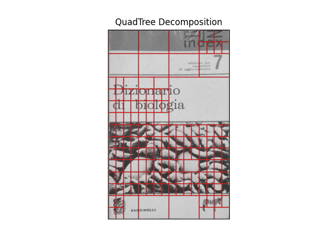

.. _bookthings:

Visual Complexity of books' cover
===================================

In this tutorial we will analyze the visual complexity of two books' cover. We will start from two images taken in the wild, we will remove the background, interpolate the cover, and subsequently evaluate the visual complexity of the two covers.

Please note that this tutorial uses rembg `https://github.com/danielgatis/rembg <https://github.com/danielgatis/rembg>`_ to remove the background. 
If you are having issues getting rembg working with numpy>=2, please use a nightly version (see `https://github.com/microsoft/onnxruntime/issues/21063 <https://github.com/microsoft/onnxruntime/issues/21063>`_ for more details):

>>> python -m pip install coloredlogs flatbuffers numpy packaging protobuf sympy
>>> python -m pip install -i https://aiinfra.pkgs.visualstudio.com/PublicPackages/_packaging/ORT-Nightly/pypi/simple/ ort_nightly

First we import the required libraries.

>>> import pyaesthetics
>>> from imutils.perspective import four_point_transform
>>> import cv2
>>> import numpy as np
>>> import matplotlib.pyplot as plt
>>> import imutils
>>> import rembg

Then we defined required files and paths.

>>> # Load images
>>> path_to_book1 = imutils.url_to_image('path/to/book1.jpg')
>>> path_to_book2 = imutils.url_to_image('path/to/book2.jpg')

Then, we define a function to preprocess our images.

>>> def preprocess_image(image, blur = True):
>>>     """
>>>     Preprocess the image by removing the background, detecting edges, 
>>>     and applying a perspective transform.
>>>     
>>>     :param image: The image to be processed.
>>>     :type image: numpy.ndarray
>>>     :param blur: Whether to apply Gaussian blur (default True).
>>>     :type blur: boolean
>>>     :return :  Tuple of the original image, background-removed image, warped image, and grayscale warped image.
>>>     :rtype: list of numpy.ndarray:
>>>     """
>>>     
>>>     # Remove background
>>>     image_nobg = rembg.remove(image)
>>>     
>>>     # Convert to grayscale
>>>     grayscale_img = cv2.cvtColor(image_nobg, cv2.COLOR_BGR2GRAY)
>>> 
>>>     if blur:
>>>         grayscale_img = cv2.GaussianBlur(grayscale_img, (3, 3), 0)
>>> 
>>>     # Edge detection
>>>     edges = cv2.Canny(grayscale_img, 10, 100)
>>>     edges = cv2.dilate(edges, None, iterations=1)
>>>     edges = cv2.erode(edges, None, iterations=1)
>>> 
>>>     # Find contours
>>>     contours = cv2.findContours(edges.copy(), cv2.RETR_EXTERNAL, cv2.CHAIN_APPROX_SIMPLE)
>>>     contours = contours[0] if len(contours) == 2 else contours[1]
>>>     
>>>     # Sort contours by area
>>>     contours = sorted(contours, key=cv2.contourArea, reverse=True)
>>>     
>>>     if not contours:
>>>         raise ValueError("No contours found")
>>> 
>>>     # Approximate the contour with four points
>>>     peri = cv2.arcLength(contours[0], True)
>>>     approx = cv2.approxPolyDP(contours[0], 0.02 * peri, True)
>>> 
>>>     # Ensure we have 4 points for a quadrilateral
>>>     if len(approx) == 4:
>>>         display_contour = approx
>>>     else:
>>>         display_contour = approx[:4]
>>> 
>>>     # Apply perspective transform to warp the image
>>>     warped_image = four_point_transform(image, display_contour.reshape(4, 2))
>>>     warped_image = cv2.resize(warped_image, (350, 550), interpolation=cv2.INTER_AREA)
>>> 
>>>     # Convert warped image to grayscale
>>>     warped_gray = cv2.cvtColor(warped_image, cv2.COLOR_BGR2GRAY)
>>> 
>>>     return([image, image_nobg, warped_image, warped_gray])

We can then preprocess our images:

>>> # Preprocess images
>>> book1, book1_nobg, book1_warped, book1_bw = preprocess_image(path_to_book1)
>>> book2, book2_nobg, book2_warped, book2_bw = preprocess_image(path_to_book2)

We can now visualize the results of the background removal and bird-eye view transform.

>>> # Display results
>>> fig = plt.figure('Image Processing Examples')
>>> plt.clf()
>>> 
>>> books = [[book1, book1_nobg, book1_warped, book1_bw], [book2, book2_nobg, book2_warped, book2_bw]]
>>> 
>>> for i, book in enumerate(books):
>>>     original, nobg, warped, bw = book
>>>     plt.subplot(2, 3, i * 3 + 1)
>>>     plt.title('Original Image')
>>>     plt.imshow(original[..., ::-1])  # Convert BGR to RGB
>>>     
>>>     plt.subplot(2, 3, i * 3 + 2)
>>>     plt.title('Background Removed')
>>>     plt.imshow(nobg[:,:,:3][...,::-1])
>>>     
>>>     plt.subplot(2, 3, i * 3 + 3)
>>>     plt.title('Warped and Scaled')
>>>     plt.imshow(warped[..., ::-1])  # Convert BGR to RGB
>>>     
>>>     # Calculate visual complexity
>>>     complexity = pyaesthetics.visualcomplexity.get_visual_complexity_quadtree(bw, 30, 20, standardized=True)
>>>     print(f'Visual Complexity of Book {i+1} cover: {complexity:.4f}')
>>> 
>>> # Remove axis ticks for cleaner display
>>> for axis in fig.axes:
>>>     axis.set_xticks([])
>>>     axis.set_yticks([])
>>> plt.show()

Now that the images have been preprocessed, we can perform the quadratic tree decomposition.

>>> # Plot quad-tree decomposition
>>> pyaesthetics.quadtreedecomposition.quadTree(book1_bw, 30, 20).plot()
>>> pyaesthetics.quadtreedecomposition.quadTree(book2_bw, 30, 20).plot()

