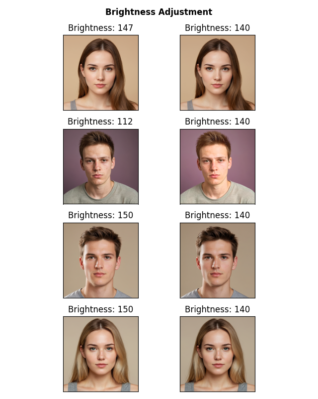

.. _brightnessadjustment:

Brightness adjustment
=========================

In this tutorial we will cover a common task in social sciences/psychology experiments that involve the presentation of different visual stimuli: Brightness adjustment. 
Given a set of images, we will adjust the brightness of each image to the mean brightness of the whole set of images.
In this example we will use four images of faces, we will measure their average brightness, then change the brightness of each image to the mean.

First we import the required libraries.

>>> import pyaesthetics  # Custom module for aesthetic computations like brightness
>>> import cv2  # OpenCV for image processing
>>> import matplotlib.pyplot as plt  # Matplotlib for plotting images

Then we defined required files and paths.

>>> # List of file paths to the images
>>> images = [
>>>     "path/to/face1.png",
>>>     "path/to/face2.png",
>>>     "path/to/face3.png",
>>>     "path/to/face4.png"
>>> ]

We also define a function to change the brightness of an image.

>>> def change_brightness(img, value):
>>>     """
>>>     Adjust the brightness of an image by adding a value to the V (brightness) channel in the HSV color space.
>>> 
>>>     
>>>     :param img: The image to be adjusted.
>>>     :type img: numpy.ndarray
>>>     :param value: The amount to adjust the brightness by.
>>>     :type value: int
>>>     :return :  The brightness-adjusted image.
>>>     :rtype: numpy.ndarray:
>>>     """
>>>     
>>>     # Convert image to HSV color space
>>>     hsv = cv2.cvtColor(img, cv2.COLOR_BGR2HSV)
>>>     h, s, v = cv2.split(hsv)
>>>     
>>>     # Adjust the brightness (V channel)
>>>     v = cv2.add(v, value)
>>>     v[v > 255] = 255  # Ensure values do not exceed 255
>>>     v[v < 0] = 0      # Ensure values do not go below 0
>>>     
>>>     # Merge channels back and convert to BGR color space
>>>     final_hsv = cv2.merge((h, s, v))
>>>     img = cv2.cvtColor(final_hsv, cv2.COLOR_HSV2BGR)
>>>    
>>> return(img)

First, we need to measure the original brightness of each image, and calculate the mean.

>>> # Loop through each image file and obtain the original brightness.
>>> for image in images:
>>>     img = cv2.imread(image)  # Read the image
>>>     img = cv2.cvtColor(img, cv2.COLOR_BGR2RGB)  # Convert image to RGB color space
>>>     # Compute relative luminance using the BT.601 standard and store it
>>>     bt601s.append(pyaesthetics.brightness.relativeluminance_bt601(img))
>>> 
>>> 
>>> # Calculate the average brightness across all images
>>> average_bt601 = sum(bt601s) / len(images)

Subsequently, we loop again through the images and adjust the brightness until it matches the mean brightness.

>>> >>> # Create a figure for displaying images
>>> fig = plt.figure('Figure')
>>> plt.suptitle('Brightness Adjustment', fontweight="bold")
>>> 
>>> # Loop through each image again to adjust brightness
>>> for image in images:
>>>     img = cv2.imread(image)  # Read the image again
>>>     img = cv2.cvtColor(img, cv2.COLOR_BGR2RGB)  # Convert to RGB color space
>>>     
>>>     # Adjust brightness to match the average brightness
>>>     img2 = change_brightness(img, value=average_bt601 - bt601s[images.index(image)])
>>>     bt601 = pyaesthetics.brightness.relativeluminance_bt601(img2)  # Calculate brightness of the adjusted image
>>>     
>>>     # Adjust further if needed, until the brightness matches the average
>>>     while round(bt601) != round(average_bt601):
>>>         img2 = change_brightness(img2, value=average_bt601 - bt601)
>>>         bt601 = pyaesthetics.brightness.relativeluminance_bt601(img2)
>>>         print(average_bt601, bt601)
>>>     
>>>     # Plot original image
>>>     plt.subplot(len(images), 2, images.index(image) * 2 + 1)
>>>     plt.imshow(img)
>>>     plt.title('Brightness: ' + str(round(bt601s[images.index(image)])))
>>>     
>>>     # Plot adjusted image
>>>     plt.subplot(len(images), 2, images.index(image) * 2 + 2)
>>>     plt.imshow(img2)
>>>     plt.title('Brightness: ' + str(round(pyaesthetics.brightness.relativeluminance_bt601(img2))))
>>>     
>>>     # Remove axis ticks for cleaner display
>>>     for axis in fig.axes:
>>>         axis.set_xticks([])
>>>         axis.set_yticks([])
>>> 
>>> # Adjust layout to prevent overlap
>>> plt.tight_layout()

