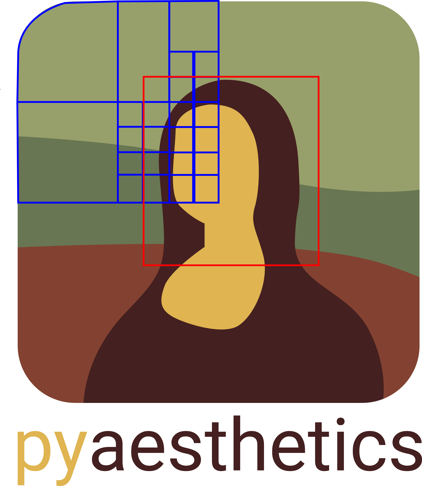

.. Website Aesthetic Analyzer documentation master file, created by
   sphinx-quickstart on Thu Apr 12 14:42:35 2018.
   You can adapt this file completely to your liking, but it should at least
   contain the root `toctree` directive.

Pyaesthetics - Image analysis in Python
======================================================

.. toctree::
    :hidden:

    api
    features
    gettingstarted
    examples    

.. image:: https://img.shields.io/github/release/Gabrock94/prettywebsite.svg
   :alt: GitHub release
.. image:: https://img.shields.io/pypi/v/pyaesthetics.svg
   :target: https://badge.fury.io/py/pyaesthetics
   :alt: PyPI
.. image:: https://img.shields.io/pypi/pyversions/pyaesthetics.svg
   :target: https://pypi.python.org/pypi/pyaesthetics/
   :alt: PyPI pyversions
.. image:: https://img.shields.io/pypi/status/pyaesthetics.svg
   :target: https://pypi.python.org/pypi/pyaesthetics/
   :alt: PyPI status
.. image:: https://img.shields.io/pypi/dm/pyaesthetics.svg
   :target: https://pypi.python.org/pypi/pyaesthetics/
   :alt: PyPI downloads
.. image:: https://static.pepy.tech/badge/pyaesthetics
   :target: https://pepy.tech/project/pyaesthetics
   :alt: Downloads
.. image:: https://readthedocs.org/projects/prettywebsite/badge/?version=latest
   :target: https://prettywebsite.readthedocs.io/en/latest/?badge=latest
   :alt: Documentation Status
.. image:: https://zenodo.org/badge/129248933.svg
   :target: https://zenodo.org/badge/latestdoi/129248933
   :alt: DOI

**Pyaesthetics** (formerly known as *PrettyWebsite*) is a comprehensive Python package designed to analyze and estimate various visual features related to the aesthetic properties of still images. The package provides modules for the estimation of multiple aesthetic features from still images. Pyaesthetics is ideal for researchers, designers, and developers who need to assess and quantify the aesthetic aspects of images for applications in design evaluation, content creation, and automated aesthetic analysis.

------------

Quick Installation
##################

Pyaesthetics is available via ``pip``. 
To install it, run the following command:

>>> $ pip install pyaesthetics

In order to use pyaesthetics, the following packages are also needed.

* numpy
* scipy
* pandas
* python-opencv
* matplotlib
* imutils
* pytesseract

Moreover, tesseract (tesseract-ocr) is required to perform text recognition.    
For more details on how to install and verify your tesseract installation, please refer to:
`pytesseract's github page <https://github.com/madmaze/pytesseract>`_

Testing your installation
***************************

To test your installation you can run:

>>> import pyaesthetics
>>> pyaesthetics.utils.runtest()

If no error is reported, your installation is successful. 

Updating pyaeshtetics
***************************

To update pyaesthetics, run the following command:

>>> $ pip install -U pyaesthetics

or 

>>> $ pip install pyaesthetics --upgrade

About the project 
###################

The design and implementation of pyaesthetics started ~2016, when I started workin on my master's thesis on `master's thesis
<https://www5.unitn.it/Biblioteca/en/Web/RichiestaConsultazioneTesi/364090>`_  on websites' design. Since then, the package has evolved, changed name, implemented more features, and has been used in difference academic projects, including the analysis of visual stimuli in fMRI/fNIRS experiments, coffee packages, and images' beautification. A (non complete) list of academic articles that used pyaesthetics is available below.

The project has received an open source sponsorhip from Gitkraken.

Scientific Publications that used pyaesthetic
**********************************************
* Gabrieli, G., Bornstein, M. H., Setoh, P., & Esposito, G. (2022). Machine learning estimation of users’ implicit and explicit aesthetic judgments of web-pages. Behaviour & Information Technology, 1-11.
* Bizzego, A., Gabrieli, G., Azhari, A., Lim, M., & Esposito, G. (2022). Dataset of parent-child hyperscanning functional near-infrared spectroscopy recordings. Scientific Data, 9(1), 625.
* Cianfanelli, B., Esposito, A., Spataro, P., Santirocchi, A., Cestari, V., Rossi-Arnaud, C., & Costanzi, M. (2023). The binding of negative emotional stimuli with spatial information in working memory: A possible role for the episodic buffer. Frontiers in Neuroscience, 17, 445.
* Music A., Maerten A., Wagemans J. (2023).Beautification of images by generative adversarial networks. Journal of Vision 2023;23(10):14.
* Liu, Q., Zhu, S., Zhou, X., Liu, F., Becker, B., Kendrick, K. M., & Zhao, W. (2024). Mothers and fathers show different neural synchrony with their children during shared experiences. NeuroImage, 288, 120529.

Thesis
*********************
* Gabrieli G. (2018), Using users' physiological response to predict aesthetic experience of websites, Master Degree in Human-Computer Interaction, University of Trento (Italy)
* Veldhuizen M. (2024), Analyzing the Role of Aesthetic Features in Packaging Designs  on Consumer Responses: The Case of Specialty Coffee, Master Degree in Communication Science, Vrije Universiteit (Netherlands)

Presentations 
===============
* Gabrieli, G., Scapin, G., & Esposito, G. (2022). Pyaesthetic, a python package for empirical aesthetic analysis. XXVII Conference of the International Association of Empirical Aesthetics, Philadelphia, United States.
* Gabrieli, G., & Esposito, G. (2018a, May 3–5). Neuroaesthetics and web design: How expertise shapes our perception of web pages. Concepts, Actions and Objects (CAOS), Rovereto, Italy.
* Gabrieli, G., & Esposito, G. (2018b, August 30–September 2). Neuroaesthetic of websites: Evaluating the impact of expertise and exposure to website on aesthetic judgment. International Association of Empirical Aesthetics Congress (IAEA), Toronto, Canada.

If you have used pyaesthetics in your work and your article/presentation is not on this list, please reach out to be added.

Links
========

Github Repository: `https://github.com/Gabrock94/pyaesthetics/ <https://github.com/Gabrock94/pyaesthetics/>`_

Pypi page: `https://pypi.org/project/pyaesthetics/ <https://pypi.org/project/pyaesthetics/>`_