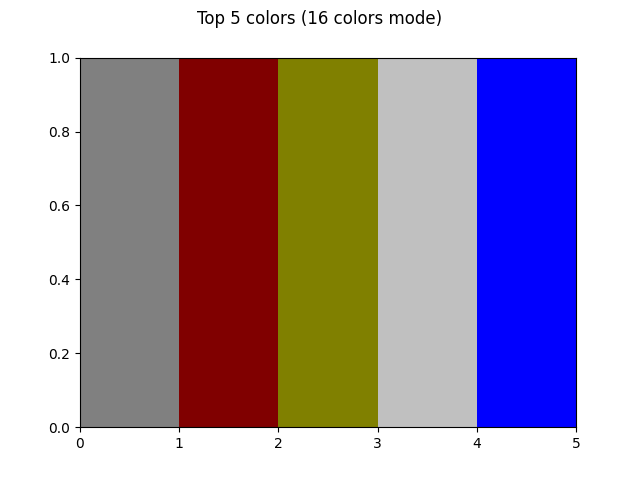
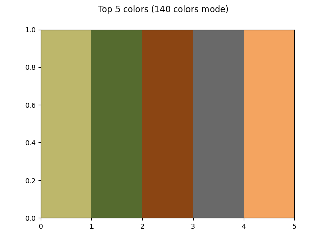
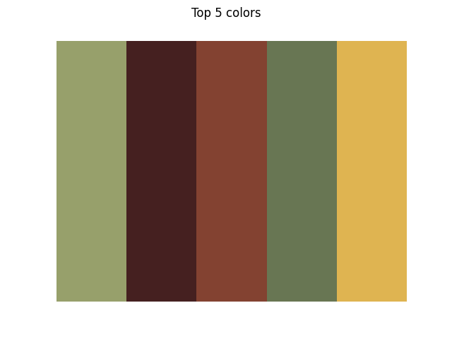

.. _colorpalette:

Extraction of Color Palette from an Image
===========================================

In pyaesthetics, it is possible to extract the palette of an image using the *colorDetection* module.
The function get_colors_w3c can be used not only to extract the percentage of colors accordingly to the W3C specification, but can also be used to generate a palette of n colors from an image.

Let's test on a sample image, the pyaesthetics logo.

.. image:: examples/pyaesthetics_small.png
   :width: 300 px
   :align: center

To extract a palette of the 5 most dominant colors closer to a named color from the W3C's 16 named colors, the following snippet can be used.

>>> import pyaesthetics
>>> import cv2
>>>
>>> sampleImg = "path/to/image"
>>> img = cv2.imread(sampleImg, cv2.IMREAD_UNCHANGED)
>>> img = cv2.cvtColor(img, cv2.COLOR_BGRA2RGBA)
>>> # Generate a palette of 5 colors using the 16 
>>> # W3C specification and plot the results
>>> pyaesthetics.colordetection.get_colors_w3c(img, 
>>>                                            ncolors=16, 
>>>                                            plot=True, 
>>>                                            plotncolors=5)

This generates the following output.

The results are not really good. The limited amount of named colors is not suitable for this image.
We can try using a more extensive list of colors (the W3C's 16 named colors). To do so, we can 
use the following snippet.

>>> import pyaesthetics
>>> import cv2
>>>
>>> sampleImg = "path/to/image"
>>> img = cv2.imread(sampleImg, cv2.IMREAD_UNCHANGED)
>>> img = cv2.cvtColor(img, cv2.COLOR_BGRA2RGBA)
>>> # Generate a palette of 5 colors using the 140 
>>> # W3C specification and plot the results
>>> pyaesthetics.colordetection.get_colors_w3c(img, 
>>>                                            ncolors=140, 
>>>                                            plot=True, 
>>>                                            plotncolors=5)

This generates the following output.

This is already much better. However, with illustrations like the logo in use(with limited variations across pixels and a limited
number of colors), we can also analyze the full spectrum of colors. To do so, we can use the following snippet:

>>> import pyaesthetics
>>> import cv2
>>>
>>> sampleImg = "path/to/image"
>>> img = cv2.imread(sampleImg, cv2.IMREAD_UNCHANGED)
>>> img = cv2.cvtColor(img, cv2.COLOR_BGRA2RGBA)
>>> # Generate a palette of 5 colors
>>> # W3C specification and plot the results
>>> pyaesthetics.colordetection.get_colors(img,plot=True, plotncolors=5, clusterfactor=1)

This is definitely more accurate as opposed to the previous two.

However, with this last function we won't be able to obtain
the names of the colors in use. For tasks in which the color name is required, the previous approaches 
are more appropriate.