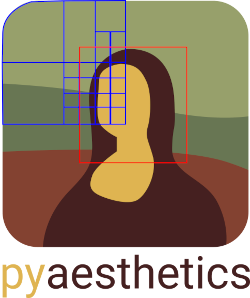

.. _colorpalette:

Extraction of Color Palette from an Image
===========================================

In pyaesthetics, it is possible to extract the palette of an image using the *colorDetection* module.
The function get_colors_w3c can be used not only to extract the percentage of colors accordingly to the W3C specification, but can also be used to generate a palette of n colors from an image.

Let's test on a sample image, the pyaesthetics logo.

To extract a palette of the 5 most dominant colors closer to a named color from the W3C's 140 named colors, the following snippet can be used.

>>> import pyaesthetics
>>> import cv2
>>>
>>> sampleImg = "path/to/image"
>>> img = cv2.imread(sampleImg, cv2.IMREAD_UNCHANGED)
>>> img = cv2.cvtColor(img, cv2.COLOR_BGRA2RGBA)
>>> # Generate a palette of 5 colors using the 140 
>>> # W3C specification and plot the results
>>> pyaesthetics.colordetection.get_colors_w3c(img, 
>>>                                            ncolors=140, 
>>>                                            plot=True, 
>>>                                            plotncolors=5)

This generates the following output.

.. image:: examples/palette.png
   :width: 300 px
   :align: center